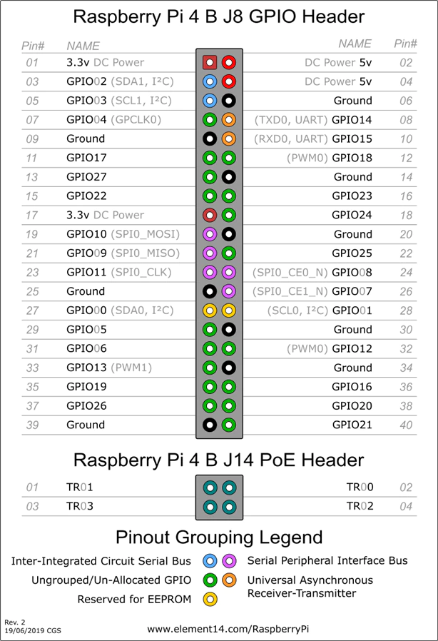

# Pinout

| Pin number | Pin name            | Direction | Function           |
|------------|---------------------|-----------|--------------------|
| 1          | 3V3                 |           |                     |
| 2          | 5V                  |    OUT    |  Power              |
| 3          | GPIO 2 - SDA        |    OUT    | Control Switch 8 R2 |
| 4          | 5V                  |           |                     |
| 5          | GPIO 3 - SCL        |    OUT    | Control Switch 8 R1 |
| 6          | GND                 |           |                     |
| 7          | GPIO 4 - GPCLK0     |    OUT    | Control Switch 7 R2 |
| 8          | GPIO 14 - TXD       |           |                     |
| 9          | GND                 |           |                     |
| 10         | GPIO 15 - RXD       |           |                     |
| 11         | GPIO 17             |    OUT    | Control Switch 7 R1 |
| 12         | GPIO 18 - PCM\_CLK  |           |                     |
| 13         | GPIO 27             |    OUT    | Control Switch 6 R1 |
| 14         | GND                 |           |                     |
| 15         | GPIO 22             |    OUT    | Control Switch 5 R2 |
| 16         | GPIO 23             |    OUT    | Control Switch 6 R2 |
| 17         | 3V3                 |           |                     |
| 18         | GPIO 24             |    OUT    | Control Switch 5 R1 |
| 19         | GPIO 10 - MOSI      |    OUT    | Control SPI0-MOSI   |
| 20         | GND                 |           |                     |
| 21         | GPIO 9 - MISO       |    IN     | Control SPI0-MISO   |
| 22         | GPIO 25             |    OUT    | Control Switch 4 R2 |
| 23         | GPIO 11 - SCLK      |    OUT    | Control SPI0-CLK    |
| 24         | GPIO 8 - CE0        |    OUT    | Control SPI0-CE0    |
| 25         | GND                 |           |                     |
| 26         | GPIO 7 - CE1        |    OUT    | Control SPI0-CE1    |
| 27         | GPIO 0 - ID\_SD     |           |                     |
| 28         | GPIO 1 - ID\_SC     |           |                     |
| 29         | GPIO 5              |    OUT    | Control Switch 4 R1 |
| 30         | GND                 |           |                     |
| 31         | GPIO 6              |    OUT    | Control Switch 3 R1 |
| 32         | GPIO 12 - PWM0      |    OUT    | Control Switch 3 R2 |
| 33         | GPIO 13 - PWM1      |    OUT    | Control Switch 2 R2 |
| 34         | GND                 |           |                     |
| 35         | GPIO 19 - PCM\_FS   |    OUT    | Control Confirm     |
| 36         | GPIO 16             |    OUT    | Control Switch 2 R1 |
| 37         | GPIO 26             |    OUT    | Control Switch 1 R1 |
| 38         | GPIO 20 - PCM\_DIN  |    OUT    | Control Switch 1 R2 |
| 39         | GND                 |           |                     |
| 40         | GPIO 21 - PCM\_DOUT |    OUT    | Control Anticonfirm |
| +          | ETHERNET 1          |   IN/OUT  | Network Connection  |
| +          | USB 1 -> ETHERNET 2 |   IN/OUT  | Network Extension   | 
## Appendix A: the Raspberry Pi 4B

